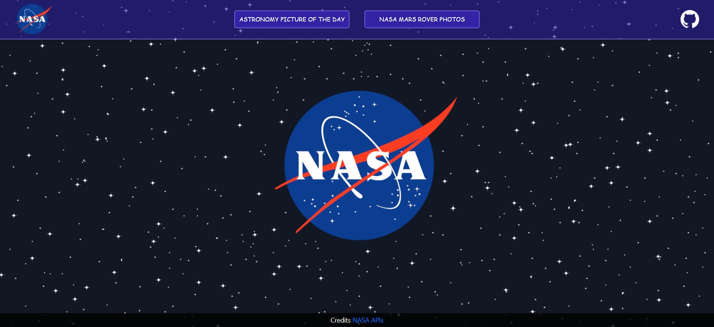
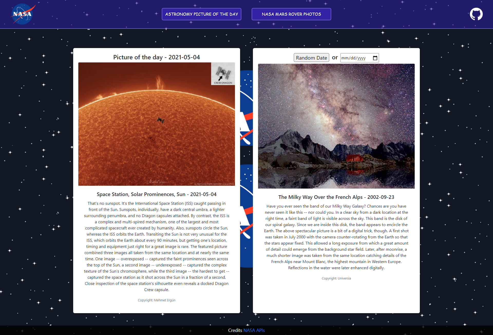
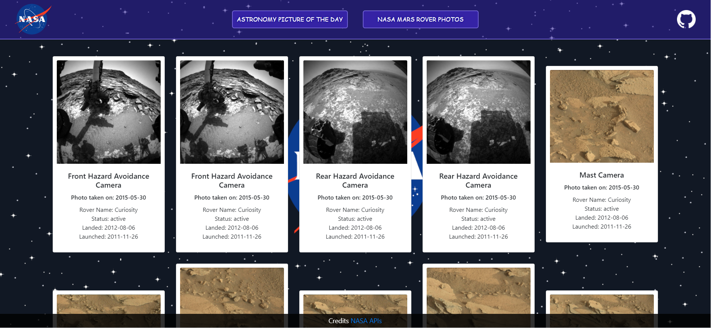

## NASA Astronomy Picture of the Day & Mars Rover Pictures

A React frontend connected to a Node backend is a rock-solid combination for any application you want to build.

APIs are what we can use to supercharge our React applications with data. There are certain operations that can’t be done on the client-side, so these operations are implemented on the server-side. We can then use the APIs to consume the data on the client-side.

The API key used in this application, is stored in a hidden file and the calls are made in the back-end, a measure used to protect the API key to be displayed in the front-end.

In this application I used NASA APIs in two different pages. One is to display the Astronomy Picture of the Day (APOD), which is one of the most popular websites at NASA, each day a different image or photograph of our fascinating universe is featured, along with a brief explanation written by a professional astronomer. The images provided by NASA goes all the way back to 1995, so I implemented two features in this application, one the user can get a picture from a random date and the second option the user can choose from any specific date. 

The other page I used Mars Rover Photo API, this API is designed to collect image data gathered by NASA's Curiosity, Opportunity, and Spirit rovers on Mars.

